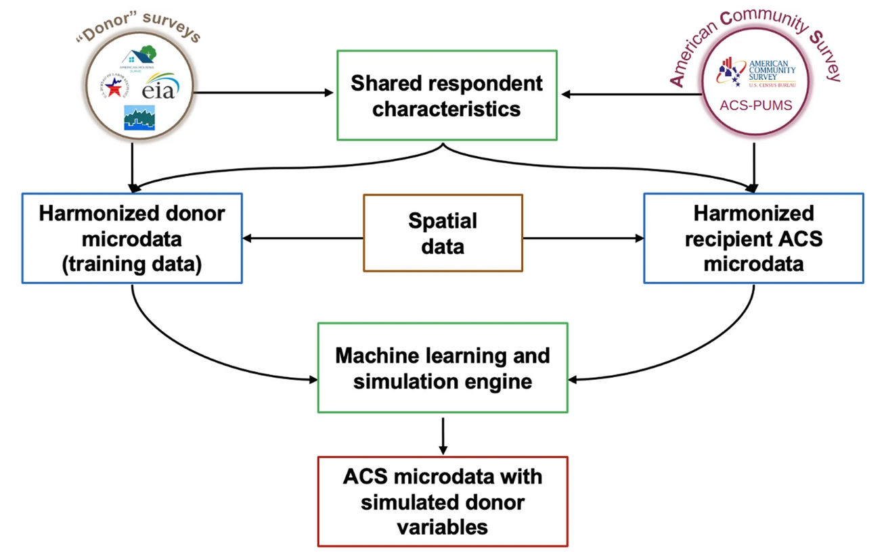

## Fusion methodology

A complete description of the fusionACS methodology is provided by @Ummel2024. For a given donor survey, the data processing and analysis "pipeline" consists of the following steps:

1. Ingest raw survey data to produce standardized microdata and documentation.
2. Harmonize variables in the donor survey with conceptually-similar variables in the ACS.
3. Prepare clean, structured, and consistent donor and ACS microdata.
4. Train machine learning models on the donor microdata.
5. Fuse the donor’s unique variables to ACS microdata.
6. Validate the fused microdata.
7. Analyze the fused microdata to calculate estimates and margins of error.

Steps 1–3 are part of the fusionData package, and Steps 4–6 are carried out using the fusionModel package. These steps are carried out by the fusionACS team internally, and there is generally no reason for a practitioner to use the associated packages.

The key functionality of Step 7 is provided by the fusionACS package documented on this site.

The figure below from @Ummel2024 shows how the various input data sources fit together.

The spatial data consists of a wide range of place-specific predictor variables that can be merged to both donor and ACS microdata on the basis of respondent location. These are used to augment the harmonized, respondent-level predictors available to the machine learning models.

## UrbanPop integration

Recent work integrating ORNL UrbanPop represents a significant advancement in the ability of fusionACS to generate high-resolution estimates across space.

UrbanPop is a synthetic population data product produced by Oak Ridge National Laboratory [@Tuccillo2023]. It provides probabilistic estimates of the location (block group) of each ACS respondent household. Specifically, for each block group, ACS PUMS respondent households are re-weighted to replicate published ACS Summary File tables for key demographic, economic, employment, mobility, and housing variables. 

Merging fusionACS microdata with UrbanPop (linking on PUMS respondent ID) results in simulated block group populations for which we can observe both ACS and donor survey variables. This allows fusionACS + UrbanPop to generate estimates for geographic areas smaller than the Public Use Microdata Areas (PUMA's) disclosed in the ACS PUMS.

Since UrbanPop assigns each ACS household to multiple block groups (about 8, on average) the merged microdata can become quite large. The public pseudo-sample includes only a partial, structured sample of the UrbanPop weights. This helps keep the public data release fully functional but also a manageable size. Analyses computed on the complete database inside the Yale High Performance Computing (HPC) facility utilize the complete UrbanPop dataset to derive production-level estimates.

## Point estimates and uncertainty

A fusionACS *analysis* consists of a request for an *estimate* of a particular variable across one or more sub-populations. Estimates can be means, medians, sums, proportions, or counts. For example, "Mean household electricity consumption in Chicago, by census tract"; or "Proportion of low-income households in Atlanta without air conditioning".

In addition to a point estimate, fusionACS also returns the associated uncertainty or *margin of error*. Uncertainty in the underlying machine learning models is captured through the production of *M* unique *implicates* (typically 20). Each implicate is a unique and equally-plausible simulation of the fused variables given uncertainty in the underlying fusion process. The public pseudo-sample includes only a single implicate (*M=1*).

By assessing the variance both within and across implicates, it is possible to calculate the margin of error associated with any given point estimate.

### Pooled variance

For any given fusionACS analysis, the point estimates and associated margin of error are calculated using the technique of @Rubin1987. The point estimate, $\bar{\theta}$, is the mean of the individual estimates calculated for each of the $M$ implicates:

$$
\bar{\theta} = \frac{1}{M} \sum_{i=1}^{M} \hat{\theta}_i
$$ The variance of $\bar{\theta}$ is calculated by "pooling" the variance both within and between samples:

$$
\text{Var}_{\text{combined}} = \frac{1}{M} \sum_{i=1}^{M} \text{Var}( \hat{\theta}_i ) + \left( 1 + \frac{1}{M} \right) \text{Var}_{\text{between}}
$$ 

where $\text{Var}_{\text{between}}$ is the "between-sample" variance of the individual estimates:

$$
\text{Var}_{\text{between}} = \frac{1}{M - 1} \sum_{i=1}^{M} \left( \hat{\theta}_i - \bar{\theta} \right)^2
$$

and $\text{Var}( \hat{\theta}_i )$ refers to the "within-sample" variances of the $M$ individual estimates; i.e. the square of the standard error [$\text{SE}( \hat{\theta} )^2$].

### Within-sample standard errors

The calculation of within-sample standard errors depends on the type of estimate requested. To calculate the standard error of a mean estimate for a sample of $n$ observations with frequency weights $w_i$:

$$
SE(\hat{\theta}_{\text{mean}}) = \sqrt{ \frac{ \sum w_i (x_i - \bar{x}_w)^2 }{ \sum w_i - 1 } \cdot \frac{1}{n_{\text{eff}}} }
$$
where $\bar{x}_w$ is the weighted mean and $n_{\text{eff}}$ is the effective sample size calculated from the observation weights:

$$
n_{\text{eff}} = \frac{ \left( \sum w_i \right)^2 }{ \sum w_i^2 }
$$
The observations weights either come directly from the ACS PUMS or from ORNL UrbanPop, depending on the level of geographic detail required by an analysis. By default, `assemble()` automatically chooses the appropriate weights. The public pseudo-sample includes only a partial, structured sample of the UrbanPop weights.

The use of the "effective sample size" $(n_{\text{eff}})$ -- rather than sample size $n$ -- helps capture additional uncertainty in the sample weights themselves [@Kish1965; @Lumley2010]. In general, the smaller the target population the greater the "unevenness" of the observed sample weights, leading to $n_{\text{eff}}<n$, and a corresponding increase in the standard error.

This approach differs from the "Successive Differences Replication" (SDR) method typically used to calculate the margin of error when working with the ACS PUMS [@Census2020]. However, in initial testing we find that the SDR and effective sample size approaches yield very similar uncertainty estimates $(correlation \approx 0.9)$, with the latter exhibiting a slight upward bias. Since SDR requires significantly more computation, for the time being we have opted to use the effective sample size technique instead.

The implementation in *R* uses the *collapse* package `qsu()` function [@Krantz2025], which computes the mean, standard deviation, and sum of weights in a single pass through the data in C/C++. This provides extremely fast calculation, even when the data is grouped across $M$ implicates and (optionally) user-specified sub-populations.

For median estimates, calculation of the standard error via bootstrapping is prohibitively expensive [@Hahn1991]. Given the need for computational efficiency in the fusionACS context, the standard error of the median is instead estimated using the large-sample approximation:

$$
SE(\hat{\theta}_{\text{median}}) \approx \frac{1}{2f(m)} \cdot \frac{1}{\sqrt{n_{\text{eff}}}}
$$
where $f(m)$ is the density at the median. The formula arises from the asymptotic variance of sample quantiles under regularity conditions [@Serfling1980]. For speed, $f(m)$ is approximated using a finite difference of the quantile function [@Koenker2005]:

$$
f(m) \approx \frac{p_2 - p_1}{Q(p_2) - Q(p_1)}
$$

where $Q(p)$ is the weighted quantile function, and $p_1$ and $p_2$ are probabilities close to the median (0.475 and 0.525, by default). Implementation via the *collapse* package leverages a single, radix-based ordering of the input to efficiently compute the median, $Q(p_1)$, and $Q(p_2)$. This allows the standard error to be estimated at little additional cost beyond computation of the median itself.

If $f(m)$ is undefined, the code falls back to the conservative approximation of @Tukey1977:

$$
SE(\hat{\theta}_{\text{median}}) \approx SE(\hat{\theta}_{\text{mean}})  \cdot \frac{\pi}{2}
$$
To calculate the standard error of a proportion, given the previously-defined effective sample size:

$$
SE(\hat{\theta}_{\text{proportion}}) = \sqrt{ \frac{ \hat{p}^*(1 - \hat{p}^*) }{ n_{\text{eff}} } }
$$

where $\hat{p}^*$ is the Agresti-Coull [@Agresti1998] adjusted proportion derived from the weighted sample proportion ($\hat{p}$), assuming a 90% confidence interval ($z=1.645$):

$$
\hat{p}^* = \frac{ \hat{p} \cdot n_{\text{eff}} + \frac{z^2}{2} }{ n_{\text{eff}} + z^2 }
$$

This adjustment ensures a non-zero standard error when $\hat{p}(1 - \hat{p})$ is zero; e.g. for unobserved outcomes in smaller samples. The un-adjusted sample proportion ($\hat{p}$) is always returned as the point estimate.

For sums (numerical case) and counts (categorical case), the standard error is a multiple of the standard error of the mean and proportion, respectively:

$$
SE(\hat{\theta}_{\text{sum}}) = SE(\hat{\theta}_{\text{mean}}) \cdot \sum w_i
$$

$$
SE(\hat{\theta}_{\text{count}}) = SE(\hat{\theta}_{\text{proportion}}) \cdot \sum w_i
$$

### Margin of error

Having calculated $\text{Var}_{\text{combined}}$ and its component variances, the degrees of freedom is calculated using the formula of @Barnard1999. Compared to the original @Rubin1987 degrees of freedom, this formulation allows for unequal within-sample variances and is more accurate for small samples.

$$
\nu = (M - 1) \left( 1 + \frac{ \frac{1}{M} \sum_{i=1}^{M} \text{Var}(\hat{\theta}_i) }{ \text{Var}_{\text{between}} } \right)^2
\bigg/
\left( \frac{1}{M - 1} + \frac{1}{M^2} \cdot \frac{ \sum_{i=1}^{M} \text{Var}(\hat{\theta}_i)^2 }{ \text{Var}_{\text{between}}^2 } \right)
$$

In keeping with the convention used by the U.S. Census Bureau for published ACS estimates, fusionACS returns the 90% margin of error:

$$
\text{ME}_{90\%} = t_{0.95, \, \nu} \cdot \sqrt{\text{Var}_{\text{combined}}}
$$ 

### Interpretation of uncertainty

There is no universal standard for judging when the margin of error and/or coefficient of variation are "too high". The answer always depends on the nature of the analysis and intended application. At a minimum, generalized guidelines should be used to determine when and if valid conclusions can be drawn from specific estimates; for example, see @Parmenter2013, page 2.

It is important that analyses or reports based on fusionACS data products communicate the authors’ chosen standards for determining when an estimate is sufficiently reliable to draw conclusions.

## References
